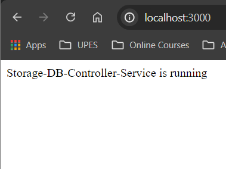

# Storage-DB-Controller-Service

This microservice handles file uploads to an S3 bucket. It is being build using Node.js, Express, and AWS SDK, and is being containerized using Docker.


### Prerequisites


- [Node.js](https://nodejs.org/) (latest ver.)
- [npm](https://www.npmjs.com/get-npm) (comes with Node.js)
- [AWS account](https://aws.amazon.com/) (with S3 permissions)
- [Docker](https://www.docker.com/) (optionally maybe used if required)


### Installation

1. Clone the repository
2. Navigate to `server/Storage-DB-Controller-Service`
3. Install dependencies:
   ```bash
   npm install express aws-sdk multer dotenv multer-s3
      ```


### Folder Structure
The project has the following structure:

 ```bash

Storage-DB-Controller-Service/
├── node_modules/            # Contains all npm dependencies
├── src/
│   ├── routes/
│   │   └── upload.js        # Defines routes for file upload
│   ├── config/
│   │   └── s3.js            # AWS S3 configuration
│   ├── controllers/
│   │   └── uploadController.js # Controller for handling file uploads
│   └── app.js               # Main application file
├── .env.example             # Example environment variables file
├── .env                     # Environment variables file
├── package.json             # npm configuration file
└── Dockerfile               # Docker configuration file

 ```

# Description:

-node_modules/: This folder contains all the npm dependencies required by the project.

-src/routes/:

1. upload.js: This file defines the routes for handling file uploads to the S3 bucket.
src/config/:

2. s3.js: This file configures the AWS SDK to interact with S3 using the provided credentials and region.
src/controllers/:

3. uploadController.js: This controller handles the logic for uploading files to the S3 bucket.
src/app.js: The main application file that sets up the Express server and includes the routes.

- .env: The actual environment variables file where you specify your AWS credentials and other configurations.

- package.json: Contains the project metadata and npm dependencies.

- Dockerfile: Contains the instructions to build a Docker image for the service.
 

### Screenshot 



